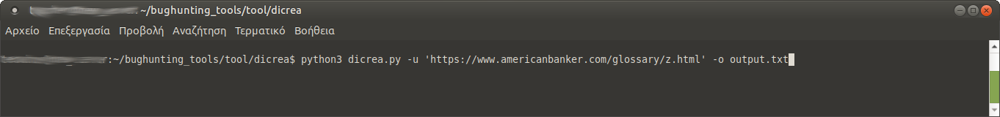
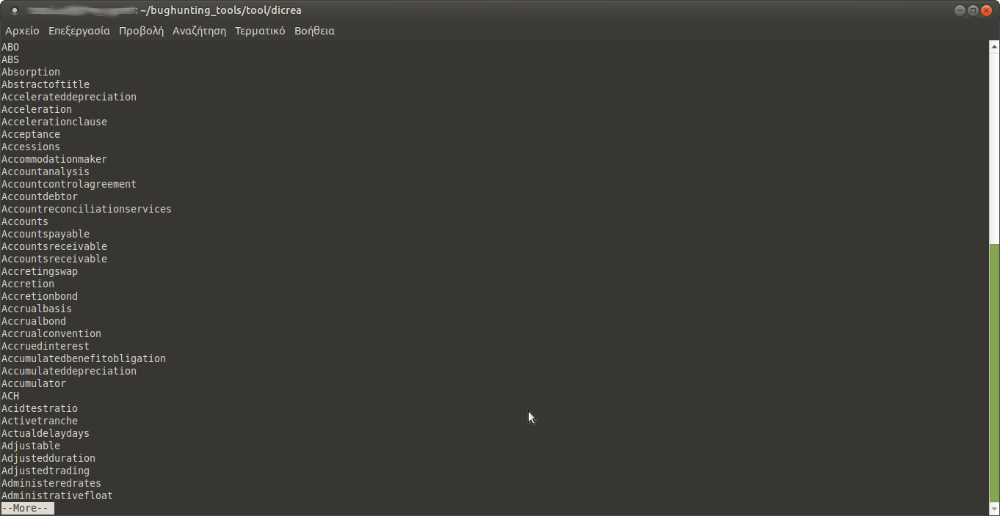

# dicrea
A dictionary creator 
Input is usually a web page containing terms and glossary of a specific sector. Using regexps and \<p><b\> as statring delimiters every term is extracted and stored in an output file
```console
python3 dicrea.py -h
usage: dicrea.py [-h] [-f FILE] [-u URL] [-o OUTPUT] [-a APPEND]

This is a dictionary creator

optional arguments:
  -h, --help            show this help message and exit
  -f FILE, --file FILE  Input file
  -u URL, --url URL     Input url
  -o OUTPUT, --output OUTPUT
                        Output file
  -a APPEND, --append APPEND
                        Append to output file
```



